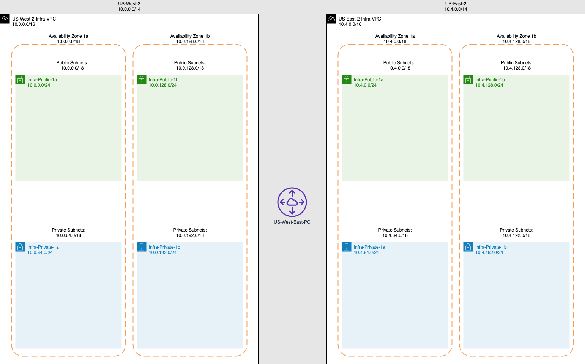

# aws-infra-terraform
This project is used to standardize and deploy the core infrastructure 
components in AWS across multiple regions using terraform. The goal is
to programmatically deploy and manage multiple environments (production, 
development, staging, etc) across any number of regions from a central 
location while maintaining isolation between environments and regions 
within Teffaform.

#Architecture




# Setup
### AWS Credentials
AWS credentials are assumed to be passed in from your local aws credentials 
file using profiles for each environment. `profile` variables are set in the 
enviroment `provider` file.

### Terraform Workspaces
Create a workspaces for each region within the environment 
(production, development, staging, etc) you plan to deploy
and work within. This is how isolation is achieved between regions and 
environments.

Navigate to the environment you want to work with then 
initialize terraform and then create a workspace for each region.

Here we are creating two workspaces `us-east-1` and `us-west-2`
in the `production` environment.
```text
cd environments/production
terraform init
terraform workspace new us-east-1
terraform workspace new us-west-2
```
You will be automatically dropped into the workspace 
once it is created. Listing the workspaces now should look like this:
```text
terraform workspace list         
  default
  us-east-1
* us-west-2
```

# Usage
Navigate to the environment you want to work with if you are not already 
there from the step above. Then select the workspace of the region you 
want to deploy and work within
```text
cd environments/production 
terraform workspace select us-west-2
```
When ready `plan` and `apply` changes for each region
```
terraform plan -var-file=us-west-2.tfvars
terraform apply -var-file=us-west-2.tfvars
terraform plan -var-file=us-east-1.tfvars
terraform apply -var-file=us-east-1.tfvars
```

Repeat these steps for additional environment and or regions
